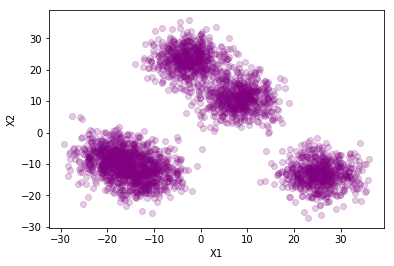
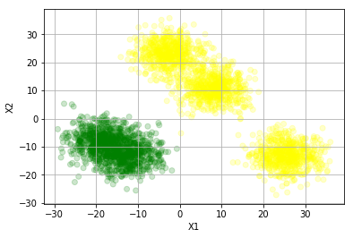
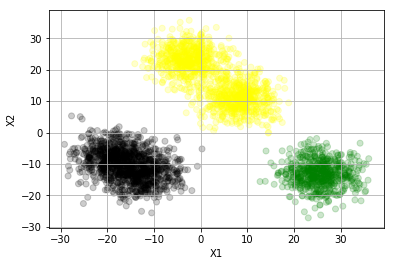
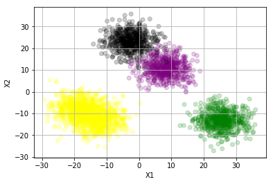
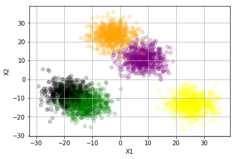
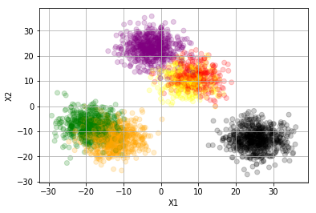
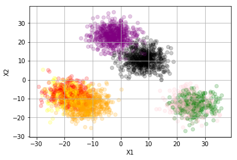
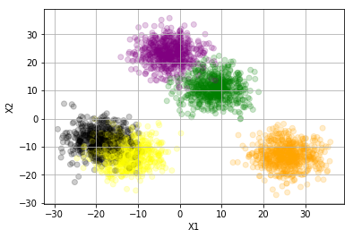
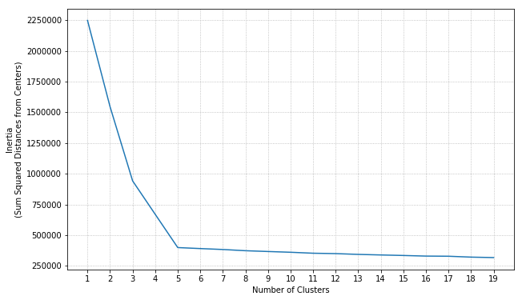
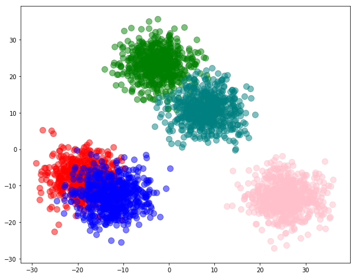

### Questions
- Show how and when we will use elbow plot

### Objectives
YWBAT
- measure the correct number of clusters to use
- *use various metrics to decide cluster numbers and create a pipeline for new data points*
- apply different clustering techniques and compare to kmeans

### Outline


```
import pandas as pd
import numpy as np

from sklearn.datasets import make_blobs
from sklearn.cluster import KMeans, mean_shift
from sklearn.metrics import calinski_harabaz_score
from sklearn.model_selection import train_test_split


import matplotlib.pyplot as plt
import seaborn as sns
from sklearn.decomposition import PCA
```


```
# make a dataset with 20 features and 3 groups 
X, y = make_blobs(n_features= 20, n_samples= 3000, centers = np.random.randint(3, 10), cluster_std=4.0)

```


```
# let's visualize our data
pca = PCA(n_components = 2)
transformed = pca.fit_transform(X)
transformed[:5]
```


    array([[-11.26141758,  23.17322734],
           [-19.64592827,  -6.22074277],
           [  3.97567798,  20.39096433],
           [ 27.18044007,  -4.47365638],
           [ 24.4561806 ,  -7.28789417]])


```
plt.scatter(x = transformed[:,0],y = transformed[:,1], alpha=0.2, c='purple')
plt.xlabel("X1")
plt.ylabel("X2")
plt.show()
```





# how many clusters exist?
4, possibly 5, possibly 3


```
color_dict = {0:"green", 1: "yellow", 2: "black", 3: "purple", 4: "orange", 5: "red", 6:"pink"}
```

### Let's get some clusters


```
def view_clusters(n_clusters=3, n_components=3, plotting=False):
    kmean = KMeans(n_clusters=n_clusters)
    pca = PCA(n_components=n_components)
    X_t = pca.fit_transform(X)
    kmean.fit(X_t)
    labels = kmean.labels_
    if plotting:
        color_vec = [color_dict[l] for l in labels]
        plt.scatter(x = transformed[:,0],y = transformed[:,1], alpha=0.2, c=color_vec)
        plt.grid()
        plt.xlabel("X1")
        plt.ylabel("X2")
        plt.show()
    return kmean
```


```
view_clusters(2, n_components=10, plotting=True)
```





    KMeans(algorithm='auto', copy_x=True, init='k-means++', max_iter=300,
        n_clusters=2, n_init=10, n_jobs=1, precompute_distances='auto',
        random_state=None, tol=0.0001, verbose=0)


```
view_clusters(3, n_components=10, plotting=True)
```





    KMeans(algorithm='auto', copy_x=True, init='k-means++', max_iter=300,
        n_clusters=3, n_init=10, n_jobs=1, precompute_distances='auto',
        random_state=None, tol=0.0001, verbose=0)


```
view_clusters(4, n_components=10, plotting=True)
```





    KMeans(algorithm='auto', copy_x=True, init='k-means++', max_iter=300,
        n_clusters=4, n_init=10, n_jobs=1, precompute_distances='auto',
        random_state=None, tol=0.0001, verbose=0)


```
view_clusters(5, n_components=4, plotting=True)
```





    KMeans(algorithm='auto', copy_x=True, init='k-means++', max_iter=300,
        n_clusters=5, n_init=10, n_jobs=1, precompute_distances='auto',
        random_state=None, tol=0.0001, verbose=0)


```
view_clusters(6, n_components=10, plotting=True)
```





    KMeans(algorithm='auto', copy_x=True, init='k-means++', max_iter=300,
        n_clusters=6, n_init=10, n_jobs=1, precompute_distances='auto',
        random_state=None, tol=0.0001, verbose=0)


```
view_clusters(7, n_components=10, plotting=True)
```





    KMeans(algorithm='auto', copy_x=True, init='k-means++', max_iter=300,
        n_clusters=7, n_init=10, n_jobs=1, precompute_distances='auto',
        random_state=None, tol=0.0001, verbose=0)


### How do we choose the number of clusters?


```
k = view_clusters(5, plotting=True)
```





```
inertias = []
for i in range(1, 20):
    k = view_clusters(i, n_components=8)
    inertia = k.inertia_
    inertias.append(inertia)
```


```
plt.figure(figsize=(10, 6))
plt.grid(linestyle=':')
plt.plot(range(1, 20), inertias)
plt.xticks(range(1, 20), range(1, 20, 1))
plt.xlabel("Number of Clusters")
plt.ylabel("Inertia\n(Sum Squared Distances from Centers)")
plt.show()
```





### Comparing Kmeans to KMedians


```
from pyclustering.cluster.kmedians import kmedians
from pyclustering.cluster.dbscan import dbscan
from pyclustering.cluster.ema import ema
from pyclustering.cluster import cluster_visualizer, cluster_visualizer_multidim
from pyclustering.utils import read_sample
from pyclustering.samples.definitions import FCPS_SAMPLES
```


```
# generating 5 random starting points for our kmedians algorithm
idx = np.random.randint(0, X.shape[0], 4)
# kmedians_instance = kmedians(X, initial_centers=X[idx,:])


# kmedians_instance = dbscan(X, 15, 16)

kmedians_instance = ema(X, amount_clusters=5)

#Run cluster analysis and obtain results.
kmedians_instance.process()
clusters = kmedians_instance.get_clusters()

```


```
clusters[0][:3] # Notice these values are the indices of the points in the cluster from X
```


    [1, 12, 16]


```
clusters_ = []
for cluster in clusters:
    clusters_.append(X[cluster,:])
```


```
clusters_[0][:5] # these are the points from X that correspond to the indices from above
```


    array([[ -6.66465722,   1.96616909,   4.59835123,   9.99201255,
             -9.5581095 ,  -2.54067987,   4.70287173,   2.98899009,
             11.07739335, -10.24601656,   4.67937752,  -3.07914689,
             -7.74399711,   5.99894928,  10.99085185,   7.93529378,
             -4.53832391,  -6.42937701,  -6.01680773,  -4.42574414],
           [-13.80887751,   7.72461244,   8.43859506,   1.69025697,
             -5.20632423,  -0.72532323,   3.50691249,   4.21968906,
             10.35907727, -11.35435659,  -0.40985315,  -8.71394443,
            -12.13763174,  -4.56586595,   4.75206505,   2.1103823 ,
             -6.97179386, -11.70180342, -12.83366622,  -1.29903969],
           [ -7.98012455,  10.71607216,   8.63779337,   3.10864294,
             -7.4992885 ,  -3.99823872,   1.59674353,   3.8986959 ,
              1.7227139 ,  -4.37758835,  -2.71753336,   4.89727192,
            -16.44201735,  -7.06655787,   5.96849879,  -3.56214948,
             -9.38317765,  -8.62248891,  -5.95466613,   2.63706326],
           [-10.07388437,   9.17178212,  10.26357243,   4.39290814,
            -18.73540614,  -5.62057875,  14.92317276,  -2.29513325,
              7.27872217,  -3.19261849,   4.2052704 ,  -1.09630256,
            -11.66595723,   6.80928296,   7.81524187,  -4.82777394,
             -6.59051007,   1.97793479,  -4.01067357,  11.30278405],
           [ -5.573719  ,  10.95420727,   4.09130538,  17.44584663,
             -6.64317835,  -8.88834094,   3.38419578,   6.1320189 ,
             10.66906953,  -8.33437818,   0.79354269, -10.18737824,
            -13.52976443,  -0.82813109,  11.34531423,  -7.5238071 ,
             -6.86401738,  -5.69438989, -15.37166897,  -5.86317827]])


```
pca = PCA(n_components=2)
```


```
X_t = pca.fit_transform(X)
```


```
# grouping our transformed data into their respective clusters
clusters_ = []
for cluster in clusters:
    clusters_.append(X_t[cluster,:])
```


```
colors = ['red', 'green', 'blue', 'teal', 'pink']
```


```
plt.figure(figsize=(10, 8))
for cluster, color in zip(clusters_, colors):
    plt.scatter(cluster[:, 0], cluster[:, 1], c=color, s=100, alpha=0.5)
plt.show()
```





Read more about clustering algorithms here

https://towardsdatascience.com/the-5-clustering-algorithms-data-scientists-need-to-know-a36d136ef68

install **pyclustering** using `pip install pyclustering`

documentation here

https://codedocs.xyz/annoviko/pyclustering/classpyclustering_1_1cluster_1_1kmedians_1_1kmedians.html


Article on Kmeans vs KMedians

http://worldcomp-proceedings.com/proc/p2015/CSC2663.pdf

### Assessment
- using inertia with elbow plots
- Learnt about k-medians and other types of clusters besides k-means
- don't use Kmedians
- inertia is the sum of squared distances to centers
- I like that we can use PCA just for the 2-D vizualization
- I also learned about pyclustering


```

```
